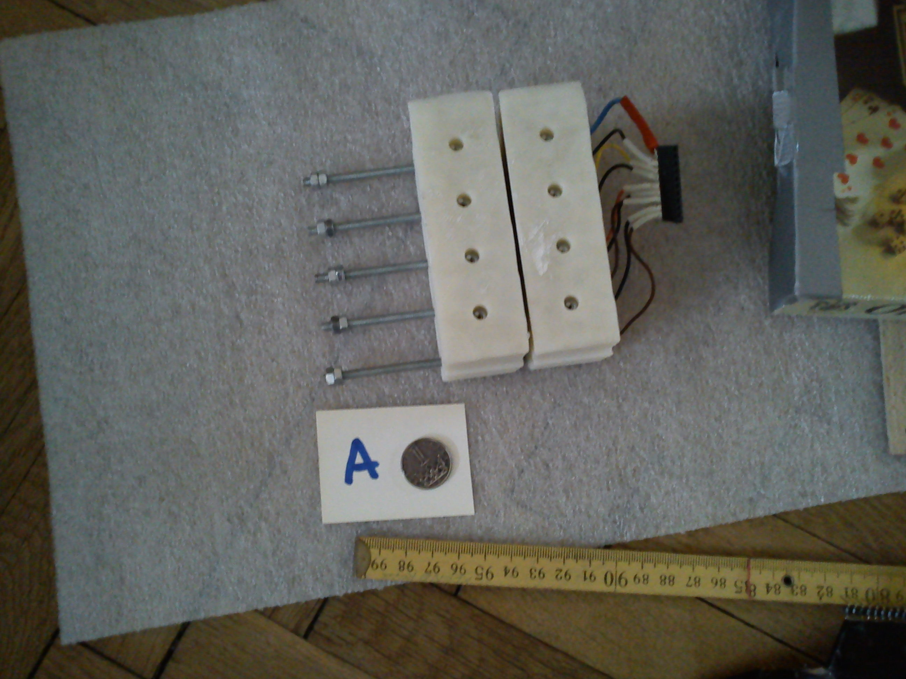
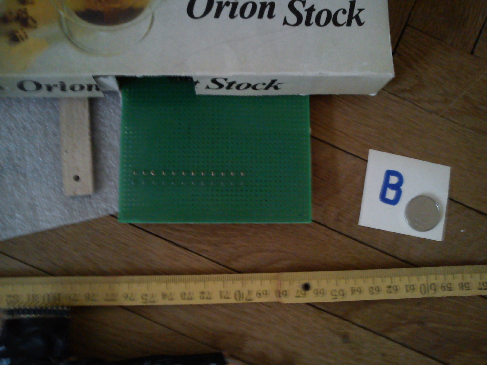
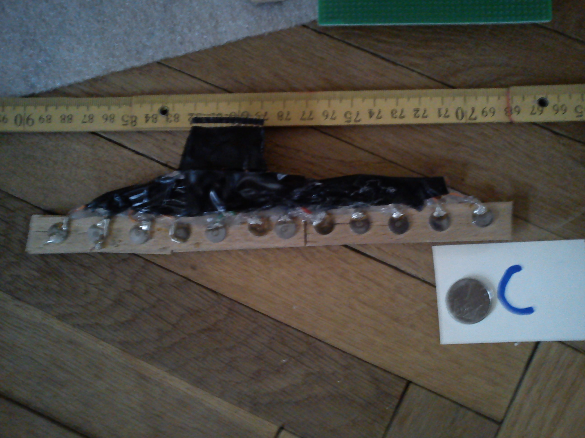
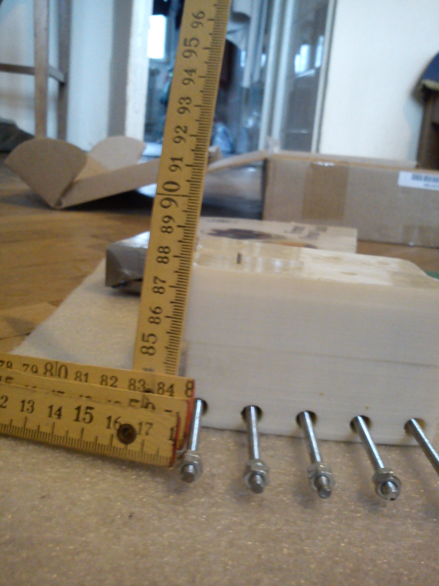

Picture 1
==============

A) The FCHAD cell, consisting of 8 solenoids whic are able to display an 8 dot braille character.

B) Sensors used in the main experiment.

C) Sensors used in the exploratory sessions.

Picture 2
==============
A raised dot displayed on the fchad cell.

